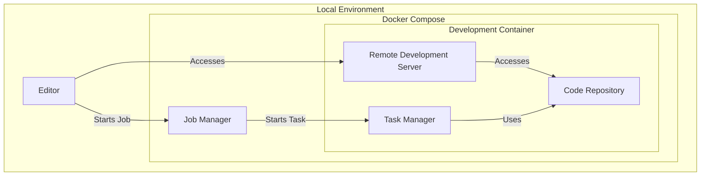

# PyFlink Dev

This project provides a template for developing Flink applications using the Python API.

## Features

- Run and debug Flink jobs locally
- Unit testing using [Pytest](https://pytest.org/)
- Dependency management using [Poetry](https://python-poetry.org/)
- A development environment using the [devcontainers](https://containers.dev/) standard

## Installation

To start using this development environment locally, follow the getting started guide for your preferred editor:

- [VS Code](https://code.visualstudio.com/docs/devcontainers/containers)
- [IntelliJ IDEA](https://www.jetbrains.com/help/idea/connect-to-devcontainer.html)
- [PyCharm](https://www.jetbrains.com/help/pycharm/connect-to-devcontainer.html)

> **Prerequisite**: Please ensure [Docker](https://www.docker.com/) is installed and running on your machine.

If you prefer not to install and configure Docker locally, GitHub Codespaces offers a convenient alternative. It allows you to create a fully configured development environment in the cloud. Please refer to the [GitHub Codespaces documentation](https://docs.github.com/en/codespaces) to get started.

## Workflow

This development environment optimizes Apache Flink's Python API development using Docker Compose for a minimal local Flink Cluster, featuring a Job Manager and a Task Manager. Using the [devcontainers](https://containers.dev/) standard, it simplifies the deployment of code changes and enables convenient debugging.



Interact with the code via your preferred editor, connected to the Remote Development Server inside the Task Manager container. The code repository is directly cloned into this container, making any updates immediately ready for deployment. Running a new Flink job involves the Job Manager coordinating with the Task Manager container to execute tasks using the latest code.

The setup allows local code execution in the development environment, enabling debugger use through your editor. This repository provides utilities for connecting the debugger to a running Flink Job, allowing for in-depth inspection of tasks and setting breakpoints directly in the execution flow.

## Usage

Follow these instructions to execute common development tasks efficiently.

### Accessing the Flink UI

The Flink UI is available at `http://localhost:8081`.

### Running a Flink Job

To run a flink job locally, simply run it with python:

```bash
python examples/word_count.py
```

> **Note**: To debug a locally running job, run the script in debug mode.

### Deploying a Flink Job

To submit a job to the job manager, use the following command. For instance, to run the `word_count` job:

```bash
flink-run examples/word_count.py
```

### Debugging a Flink Job

Debugging a live Flink job is straightforward with the use of the `flink-debug` command.

#### Initiating Debug Mode

To start debugging, execute the following command in your terminal:

```bash
flink-debug <optional_task_id>
```

> **Note**: Without arguments, `flink-debug` targets `1-1`. Specify a different task ID if needed.

Upon successful execution, the command will output a process ID (e.g., `1234`). Make a note of this ID as you will need it to attach your debugger to the correct process.

#### Debugging with VS Code

If you're using VS Code, navigate to the debugger tab. Next, click the green play button to initiate the debugger. Make sure to select the debugger profile provided with your development environment. VS Code will present a list of running processes. Choose the one that corresponds to the process ID you noted earlier. 

### Practical Example

To put these instructions into practice, consider debugging the `word_stream` example. This job continuously outputs words to standard output. Begin by starting the job with the following command:

```bash
flink-run examples/word_stream.py
```

Next, initiate the debugger:

```bash
flink-debug
```

Remember to note the process ID displayed in your console.

With the job running, proceed to open the `examples/word_stream.py` file and set a breakpoint at line `39`. This is the body of the function that processes messages as they are received from the data source. Finally, attach your debugger to the noted process. The execution will halt at the breakpoint the moment the next message is processed, enabling you to inspect the flow in real-time.

https://github.com/aureliusenterprise/pyflink-dev/assets/37906715/8b9388b2-dc2a-4c41-a156-add31da28dfb

### Unit Testing

The development environment leverages its local execution capabilities to enable unit testing for Flink jobs. An example unit test for the word count functionality is provided in `examples/test__word_count.py`. To run the unit tests, simply use the `pytest` command.
